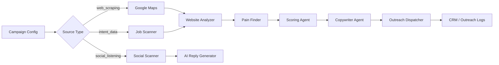

# Scoutly AI — Autonomous B2B SDR Platform 🚀

> **The AI-powered outbound engine that finds leads, analyzes their websites, writes hyper-personalized messages, and fires them — all on its own.**

Scoutly is a full-stack B2B sales automation platform. It has evolved from a simple CRM with message scheduling into a **multi-agent AI system** capable of sourcing leads from multiple channels, enriching them with real-time website intelligence, scoring them, crafting high-conversion copy in any language, and delivering outreach across WhatsApp, SMS, Telegram, and email — autonomously.

Built to power **Vysify's** outbound sales at scale.

---

## 🏗️ System Architecture (V3.0)

Scoutly runs a **pipeline of independent AI agents** on the Node.js backend. Each campaign is routed through this pipeline automatically based on its configured **Source Type**.

```
Lead Source → Scanner → Website Intelligence → Scoring → Copywriter → Outreach → CRM
```

### The AI Agent Team

| Agent | Role |
|-------|------|
| 🔍 **Research Agent** | Provider-agnostic lead sourcer. Queries Google Maps and Apollo using the campaign's segment, region, and language settings. |
| 🕷️ **Job Scanner** | Scans public job listings (LinkedIn, Gupy, Indeed) for companies hiring Sales, Support, or CS roles — a real buying-intent signal. |
| 📡 **Social Listening Scanner** | Monitors communities (HackerNews "Ask HN") for posts mentioning CRM pain points and support frustrations. |
| 🧠 **Website Intelligence Agent** | Visits each prospect's website, runs Cheerio scraping, and detects: active CRM (HubSpot/Salesforce), WhatsApp presence, e-commerce platform, and tech stack. |
| 🩺 **Pain Finder Agent** | Analyzes the website intelligence dossier and applies SPIN Selling methodology to surface 3 likely pain points per lead. |
| ⚖️ **Scoring Agent** | Combines rule-based criteria (company size, WhatsApp presence) with AI judgment to produce a **Lead Score** and **AI Investment Thesis**. |
| ✍️ **Copywriter Agent** | Ingests mapped pains, the B2B strategy, website analysis, and the offered product to craft a hyper-personalized outreach message in the campaign's language. |
| 🧠 **Memory Agent (RAG)** | Extracts "Golden Rules" from closed-deal feedback and injects them into future Copywriter prompts — enabling self-learning over time. |

---

## 🎯 Lead Source Modes

Campaigns can be configured with three distinct sourcing strategies:

### 🗺️ Web Scraping (Google Maps)
Classic outbound prospecting. Searches Google Maps for businesses matching the target segment and region, then pipes them through the full enrichment pipeline.

### 💼 Intent Data (Job Listings)
**Signal-based prospecting.** The Job Scanner looks for companies actively hiring Sales, Customer Success, or Support roles — a strong signal they need outreach automation tools. Each lead is enriched with website analysis before AI copywriting.

### 📡 Social Listening (HackerNews)
Monitors tech communities for posts describing CRM or customer support frustrations. The AI generates contextually relevant, conversation-starter replies — not cold pitches.

---

## 📋 Core Features

- **Autonomous Campaigns** — Create a campaign, configure it once, let it run on a cron schedule
- **Multi-Channel Outreach** — WhatsApp (Evolution API), SMS (Twilio), Telegram, Email (Resend)
- **Fallback Channel** — If the primary channel fails, automatically retry on a secondary one
- **Configurable Send Hours** — Choose exactly which hours of the day the scheduler fires
- **Real-Time CRM Pipeline** — Kanban board with lead stages: Found → Enriched → Sent → Opened → Responded → Booked → Lost
- **Outreach Logs** — Full history of every message sent, channel used, and delivery status
- **Intent Radar** — Live view of all intent-detected companies from job listing scans
- **AI Memory (Self-Learning)** — Closed deals teach the AI what messaging patterns work best
- **Multi-Product Support** — Define multiple products; each campaign targets specific ones
- **Geo-Targeting** — Country, state, and city level targeting with auto-language detection
- **PWA Ready** — Installable Progressive Web App with push notification support
- **Dark/Light Mode** — Full theme switching with local persistence

---

## 💻 Tech Stack

| Layer | Technology |
|-------|-----------|
| **Frontend** | React 18, TypeScript, Vite, TailwindCSS, PWA (vite-plugin-pwa) |
| **Backend** | Node.js, Express.js, SQLite (better-sqlite3) |
| **AI** | OpenAI SDK (GPT-4o / GPT-4o-mini), configurable per campaign |
| **Scraping** | Cheerio + Axios (website analysis), node-cron (job scheduler) |
| **Outreach** | Resend (email), Evolution API (WhatsApp), Twilio (SMS), Telegram Bot API |
| **Lead Sources** | Google Maps API, Apollo.io API, Public job boards (Gupy, LinkedIn, Indeed) |
| **Database** | SQLite — tables: `campaigns`, `leads`, `products`, `tenant_profiles`, `api_keys`, `ai_memory`, `outreach_logs` |

---

## 🚀 Getting Started

### Prerequisites
- Node.js 18+
- npm

### 1. Start the Backend Engine

```bash
cd backend
npm install
node server.js
```

> On first run, `scoutly.db` is created and all tables are initialized automatically. No `.env` file required for core AI keys — configure everything via the UI.

### 2. Start the Frontend

```bash
cd frontend
npm install
npm run dev
```

Access the app at **http://localhost:5173**

### 3. Configure API Keys

Go to **Settings** in the platform and enter your credentials:

| Key | Purpose |
|-----|---------|
| OpenAI API Key | AI agents (copywriting, scoring, pain analysis) |
| Google Maps API Key | Web scraping lead source |
| Apollo API Key | Contact enrichment |
| Evolution API URL + Key | WhatsApp outreach |
| Twilio SID + Token | SMS outreach |
| Resend API Key | Email outreach |
| Telegram Bot Token | Telegram outreach |

> Once keys are saved, agents exit `[MOCK]` simulation mode and operate in real time.

---

## 📁 Project Structure

```
scoutly/
├── backend/
│   ├── server.js          # Express API + route definitions
│   ├── database.js        # SQLite setup & schema migrations
│   ├── engine.js          # Campaign orchestrator + cron scheduler
│   ├── ai.js              # All AI agent logic (OpenAI calls)
│   └── utils/
│       ├── JobScanner.js        # Intent data scanner (job listings)
│       ├── SocialScanner.js     # Social listening scanner (HackerNews)
│       └── WebsiteAnalyzer.js   # Cheerio-based tech stack detector
├── frontend/
│   ├── src/
│   │   └── App.tsx        # Full React SPA (3,400+ lines)
│   └── public/            # PWA assets, manifest, icons
└── README.md
```

---

## 🔄 Campaign Pipeline (How It Works)



---

## 🗺️ Roadmap

- [ ] Multiple SMTP accounts for cold email at scale
- [ ] Webhook receiver to auto-read replies, classify intent, and send Calendly links
- [ ] A/B testing module — split leads across prompt variants and track conversion
- [ ] Native WhatsApp bulk messaging integration
- [ ] Multi-tenant support for agencies running Scoutly for multiple clients
- [ ] LinkedIn DM outreach via cookie-based session

---

## 📄 License

MIT License — built with ❤️ for the Vysify sales team.
